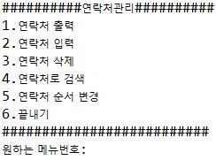
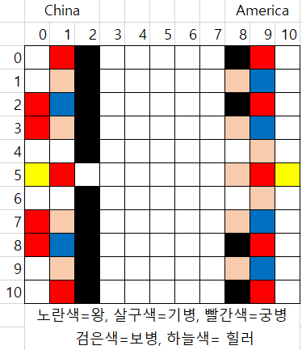
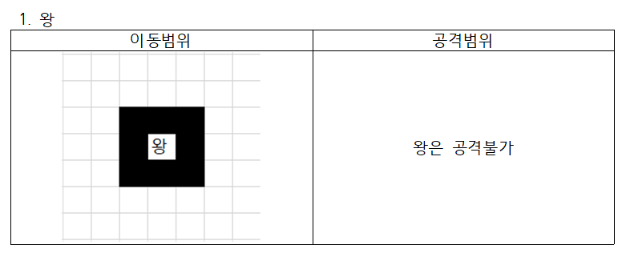
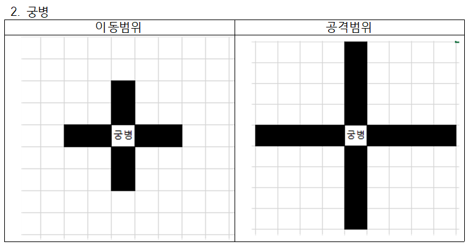
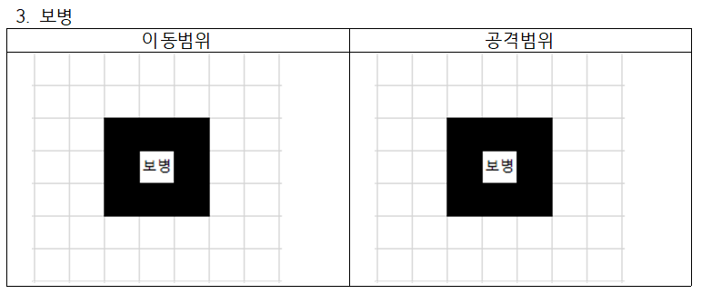
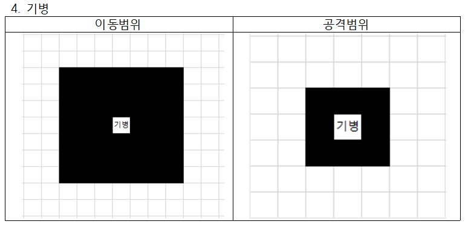
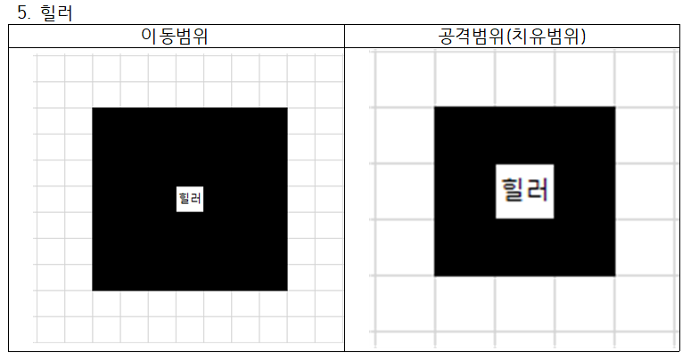
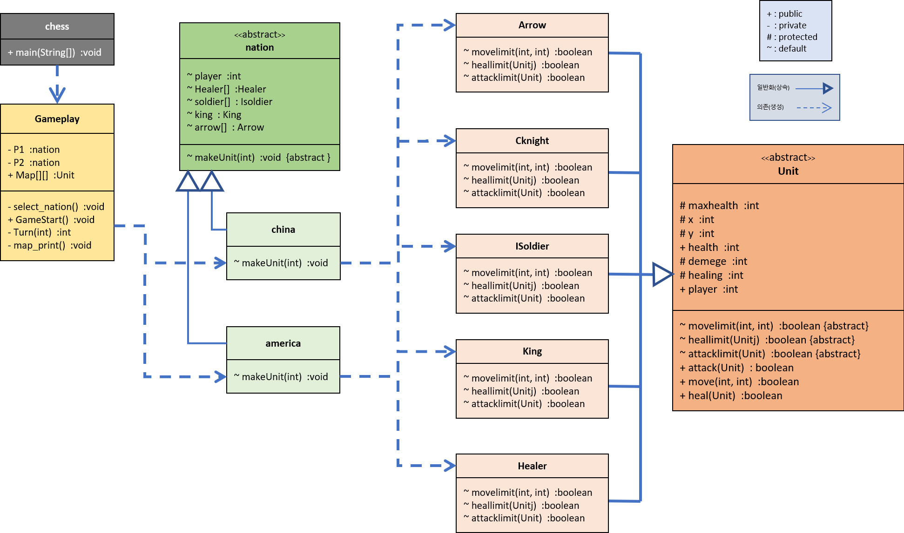

# 19-1_Java_Practice
# 2019-1 자바프로그래밍 Term Project
---
# Project 1. 연락처프로그램

---

# Project 2. 

1.	양쪽 Player는 China 혹은 America를 선택하여 플레이 가능하다.
2.	Player1이 먼저 시작하며 왼쪽 진형이다.
3.	유닛은 총 다섯 종류이며 왕, 궁병, 보병, 기병, 힐러이다. (힐러 선택시 공격이 힐로 바뀜)
4.	아군을 공격할 수는 없으며, 힐러의 경우 상대를 치유할 수 없다. 또한 빈곳을 공격하거나 치유할 수 없다.
5.	게임 Map의 가로축을x, 세로축을 y로 한다.
6.	왕이 죽을 경우 게임이 끝난다. 일반 유닛은 죽을 경우 Map에서 사라진다.
7.	각 턴마다 1.공격/힐 2.이동 3.턴 종료 세 가지 중 하나 선택이 가능하다.
8.	각 진영의 초기 유닛 배치는 다음과 같다. (좌우진영은 바뀔 수 있다.)

9.	각 유닛의 이동범위와 공격 범위(힐러의 경우 치유범위)는 다음과 같다.

①	왕(공격 불가)
⑴	이동범위

</img> 
</img> 
</img> 
</img> 
</img> 

### 클래스 다이어그램

---
# Developer:

남은우, 선태욱, 이수민
